# mplcyberpunk


[](https://pypi.python.org/pypi/mplcyberpunk)
[](https://travis-ci.com/dhaitz/mplcyberpunk)
[](https://www.python.org/downloads/release/python-390/)


A Python package on top of `matplotlib` to create 'cyberpunk' style plots with 3 additional lines of code.

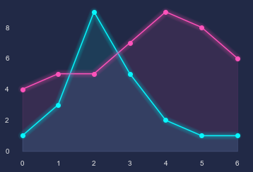

## Installation

    pip install mplcyberpunk

## Usage

After importing the package, the _cyberpunk_ stylesheet (dark background etc.) is available via `plt.style.use`.
The line glow and 'underglow' effects are added via calling `add_glow_effects`:

```python
    import matplotlib.pyplot as plt
    import mplcyberpunk

    plt.style.use("cyberpunk")

    plt.plot([1, 3, 9, 5, 2, 1, 1], marker='o')
    plt.plot([4, 5, 5, 7, 9, 8, 6], marker='o')

    mplcyberpunk.add_glow_effects()

    plt.show()
```

Result:


This effect is currently only implemented for lines.

The individual steps are described [here](https://matplotlib.org/matplotblog/posts/matplotlib-cyberpunk-style/) in more detail.


#### Add effects individually

Instead of `add_glow_effects`, you can add the line glow and underglow effects separately:

    mplcyberpunk.make_lines_glow()
    mplcyberpunk.add_underglow()


You can also add the effect to a specific axis object explicitly:

    fig, ax = plt.subplots()
    ...
    mplcyberpunk.make_lines_glow(ax)

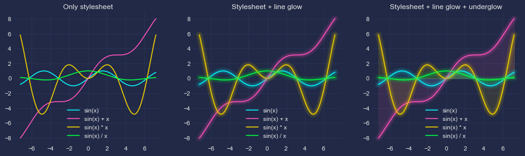


To activate the glow effect only for specific lines, pass a Line2D object or a list of Line2Ds to `make_lines_glow`.


#### Gradient glow

Gradient underglow effect can be added with

    mplcyberpunk.add_glow_effects(gradient_fill=True)

or independently of line glow with

    mplcyberpunk.add_gradient_fill(alpha_gradientglow=0.5)

`add_gradient_fill` takes a `gradient_start` argument for different gradient starting values:

 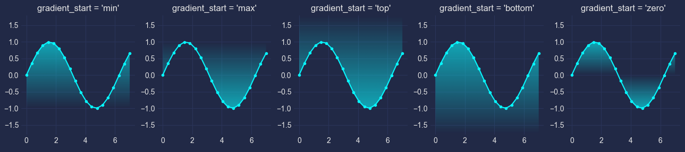


#### Different glow configurations:
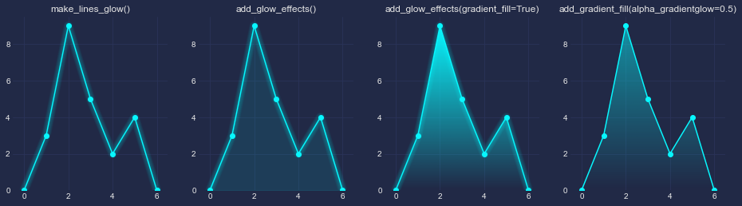


#### Scatter plots

Glow effect can be added to scatter plots via `mplcyberpunk.make_scatter_glow()`:

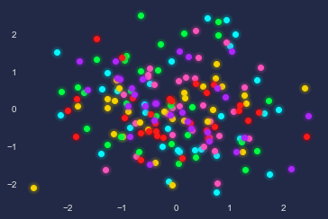

#### Colormap

The default colormap is `cool`:

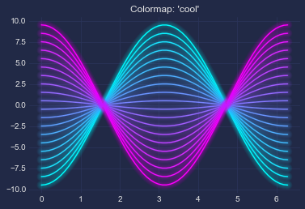

Others:


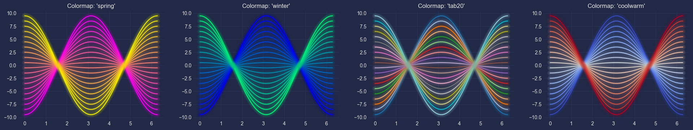


## Gallery
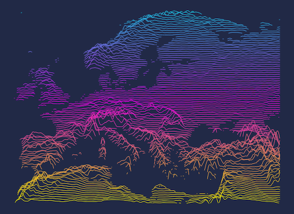
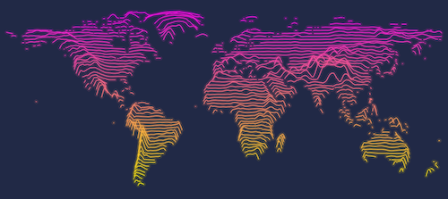

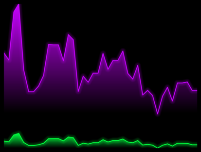
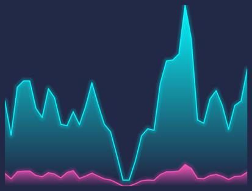


Some images can be bought as posters [here](https://displate.com/sr-artworks/dhaitz).

## Requirements
Depends only on `matplotlib`.
